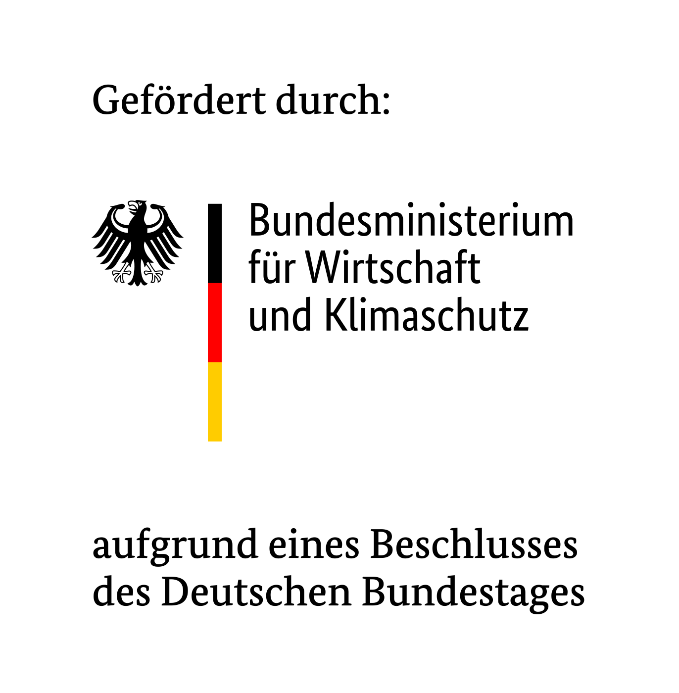

# EnergyCommunities.jl

This package presents an operation and investment optimization model for energy communities with the options for local energy (electricity and heat) trading.
The core model is documented in the paper [Link](www.google.com).

An example script together with databases is provided in the folder `example`. In the example, the status quo scenario (SQ) and the electricity trading scenario (EL), as defined in the original paper, are calculated.

## Specific types
Custom types `Year`, `Peer`, and `Tec` are created to differentiate these sets from timesteps.
These types and their associated methods are defined in `src\SetStructs.jl`.

## Database
A database is dedicated for an individual participant. A blank database can be created from the file `src\auxiliary_src\db_structure.sql` via the function `create_blankdatabase`. Each database contains the following tables:

- `id`, a table with an agent id and location information
- `pSca`, a table with scalar parameters, e.g., trading fees
- `pY`, " year-dependent parameters, e.g., energy prices
- `pTec`, " technology-dependent parameters, e.g., efficiency
- `pYTec`, " parameters dependent of years and technologies, e.g., investment costs
- `pYTS`, " parameters dependent of years and timesteps, e.g., demand- or generation profiles

## Acknowledgment

This work was conducted in the research project BKM 2.0, which was sponsored by the Federal Ministry for Economic Affairs and Climate Action of Germany (*Bundesministerium für Wirtschaft und Klimaschutz* BMWK) under the grant 03EI4015A.
